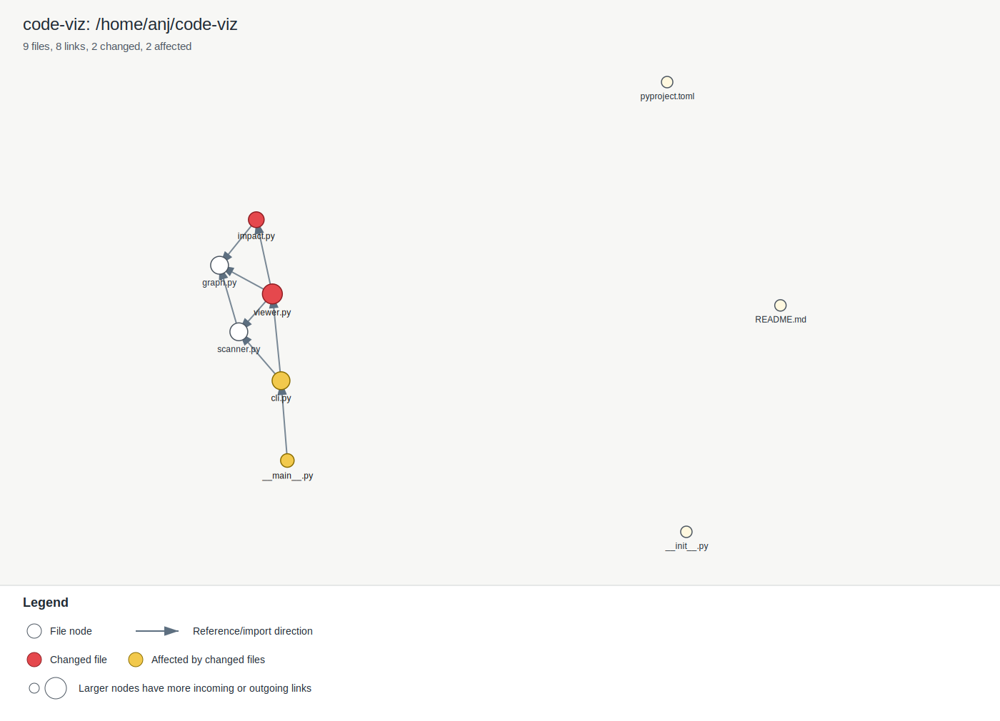

# code-viz

Local desktop dependency graph viewer for code repositories.

## Usage

Install the local CLI entry point:

```sh
python3 -m pip install -e .
```

From a repository or project directory:

```sh
code-viz init
```

During local development, without installing:

```sh
python3 -m code_viz init
```

The command scans the current working directory, builds a file dependency graph, and opens a native desktop window.

<!-- code-viz:graph:start -->
## Code Dependency Graph



Generated by `code-viz` from the local dependency scan.

Legend:

- Circles are code files.
- Arrows point from a file to another file it references or imports.
- Red nodes are changed files in the current Git working tree.
- Yellow nodes are files that depend on changed files.
- Larger nodes have more incoming or outgoing dependency links.

Files: 9. Links: 8. Changed: 2. Affected: 2.
<!-- code-viz:graph:end -->
